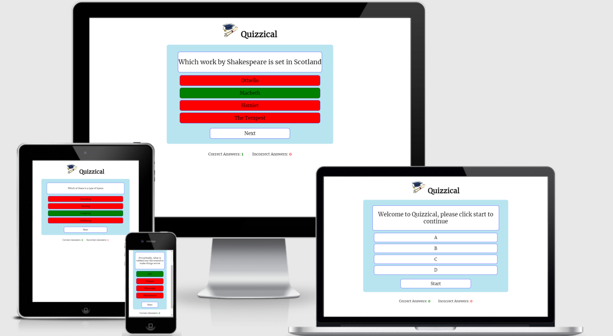
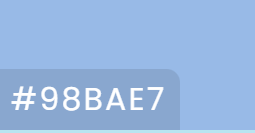
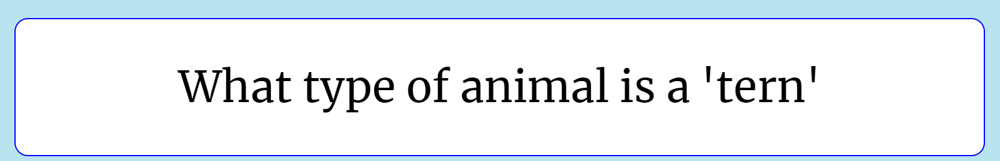
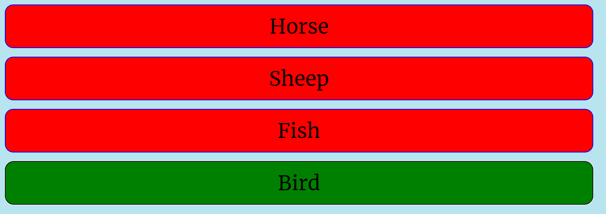
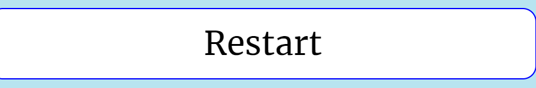
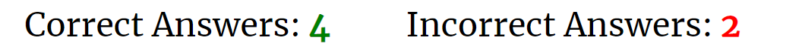
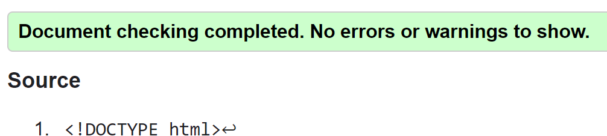
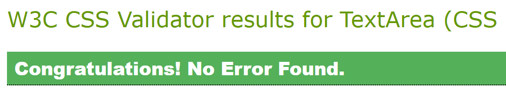
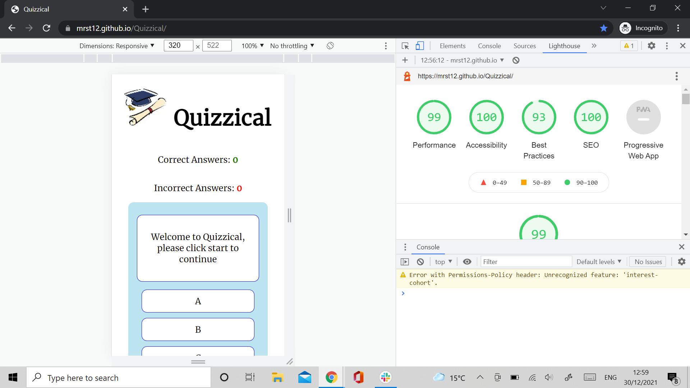

# QUIZZICAL

[view the live site here](https://mrst12.github.io/Quizzical/)

[View my Github](https://github.com/Mrst12/Quizzical)

## Final Design

## Introduction
The aim of this website was to use HTML, CSS and JavaScript to create an interactive,
front-end site, that responds to users actions. I thought that a quiz would be a great idea 
as who doesn't love a good quiz.
## Contents
- [User Experience](#user-experience-ux)
    - [User Stories](#user-stories)
- [Design](#design)
    - [Colour Scheme](#colour-scheme)
    - [Typography](#typography)
    - [Images](#images)
- [Wireframes](#wireframes)
- [Features](#features)
- [Technologies Used](#technologies-used)
    - [Languages](#languages)
    - [Programmes Used](#programmes-used)
- [Testing](#testing)
    - [Lighthouse](#lighthouse)
    - [Devices](#devices)
    - [Testing User Stories](#testing-user-stories)
    - [Known Bugs](#known-bugs)
    - [Functionality](#functionality)
- [Deployment](#deployment)
    - [Forking The Repository](#forking-the-repository)
    - [Cloning The Repository](#cloning-the-repository)
- [Credits](#credits)
    - [Code](#code)
    - [Acknowledgements](#acknowledgements)
## User Experience (UX)

- ### User Stories
    
    1. As a user, I want to test my general knowledge.
    2. As a user, I want to choose from a range of answers.
    3. As a user, I want to see my score as I progress.
    4. As a user, I want feedback from the questions.  

- ### Design
    - #### Colour scheme
        - used for background colour

        - used for hover effect on buttons

    - black was used for text
    - white was used for body background
    - blue was used for border colour
    - green was used for the text colour of correct answers
    - red was used for the text colour of incorrect answers

    - #### Typography
        - I have used **Merriweather** for the font style with a backup of sans-serif should it not be accessible for all.

- ### Images
    - The image used for the logo was taken from clipart (acknowledged in credits)

#### Wireframes

[Desktop wireframe](./assets/wireframes/quizzical-desktop.png)

[Tablet wireframe](./assets/wireframes/quizzical-tablet.png)

[Mobile wireframe](./assets/wireframes/quizzical-mobile.png)

## Features

- consists of a logo and title of the quiz

- each question is displayed randomly 10 questions per game 40 questions to choose from

- Four answers to choose from shows green for correct and red for incorrect

- Allows the user to restart at the end of a game instead of using browser refresh

- Allows user to see their correct and incorrect score as they progress

## Technologies Used
### Languages
    - HTML
    - CSS
    - JavaScript
### Programmes used
    - Balsamiq
        - For the wireframes
    - Git
        - For version control, commiting, and pushing to Github
    - Github
        - For storing the repository, files, and images pushed from Gitpod
    - Gitpod
        - IDE used to code the website
    - Chrome developer tools
        - for checking compatibilty, troubleshooting and editing code
    - Am I responsive
        - Used to test responsiveness of the website at different screen sizes.
    - Google Fonts
        - Used for the font of the website.
    - Freeformatter.com
        - To format my HTML, CSS, and Javascript code 
        
## Testing
The W3C Markup Validator, W3C CSS Validator Services and jshint.com were used to validate every page of the project to ensure there were no syntax errors in the project.

- jshint 
    - Brought up eight warnings of missing semicolons, which were all corrected.
    - Brought up three unused variables, which was rectified.

### Lighthouse
- The site was tested using Lighthouse

### Devices
- The site was tested on **Chrome** and **Safari**
- The site was tested on an iphone 7, ipad, sony Experia and my dell laptop.
### Testing User Stories
1. As a user, I want to test my general knowledge.
    - A range of 40 general knowlege questions included each game with ten
    random questions.
2. As a user, I want to choose from a range of answers.
    - Four possible answers are available to choose from.
3. As a user, I want to see my score as I progress.
    - There is a correct and incorrect score counter at the bottom for the user to see.
4. As a user, I want feedback from the questions.
    - The correct answer shows green, the incorrect answers shows red.

### Known Bugs
- slight scroll needed to see the incorrect answers at times.

### Functionality
## Deployment

### Forking the repository
### Cloning the repository
## Credits
- [logo image](https://www.pinclipart.com/)
### Code
### Acknowledgements: